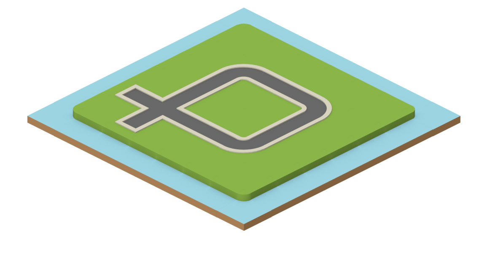

# Traffic

## Goal

Render out a isometric square grid with auto moving vehicles. A framework test for a game related to path-finding (code-wise; theme tbd).

Since my very first programming class, I have always thought of some traffic simulator as that was my first impressions of if-statements and information flow. This will be a personal project that will progress slowly over the days/months/years. There is no time frame or end-goal set, just a rough idea of what to tackle. Path-finding algorithms will be the first major tackle.

## Latest rendered snapshot

> 2016-09-07

## Asset Source

Although not required, this project is largely possible due to the free assets from [http://kenney.nl/](http://kenney.nl/).

## Setup instructions

* `$ npm install`
* `$ npm run pack` (browserify + tsify and lint)
    * @see *package.json* for more npm run scripts
